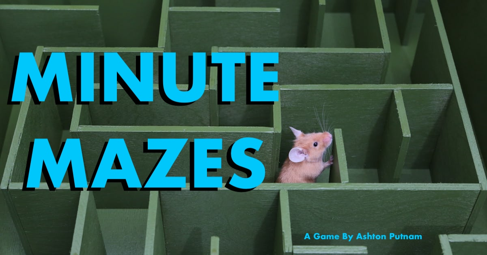

# Description: 
Minute mazes is a basic game where the player has to navigate through a maze to reach the exit. The maze is generated with a depth-first search algorithm and constructed with Python Arcade 3.3.3. The player can move up, down, left, and right. The player can collect cheese in the maze and their score is displayed on the screen along with elapsed time for each maze.

### Setup
```
git clone https://github.com/ashton-put/MinuteMazesPython.git
python -m venv <your environment name>
source .<your environment name>/bin/activate
pip install -r requirements.txt
python play.py
```

### Controls
- When ```play.py``` is run - the Main Menu screen buttons direct the player to choose either:
```
| Start Game |
|  Settings  |
|    Quit    |
```

- In the 'Settings' menu, the player can adjust the maze size:
```
|   Small (21x21)   |
|   Medium (31x31)  |
|   Large (51x51)   |

| Back to Main Menu |
```

- ```| Start Game |``` starts the game with the selected maze size.

- During gameplay:

```
WASD / Arrow Keys === Move through maze
        R         === Reset current maze (elapsed time and current score)
    ESC / ENTER   === Pause menu
```


  - In the pause menu the player can choose to resume the game, restart the current maze, return to the main menu, or quit the game.