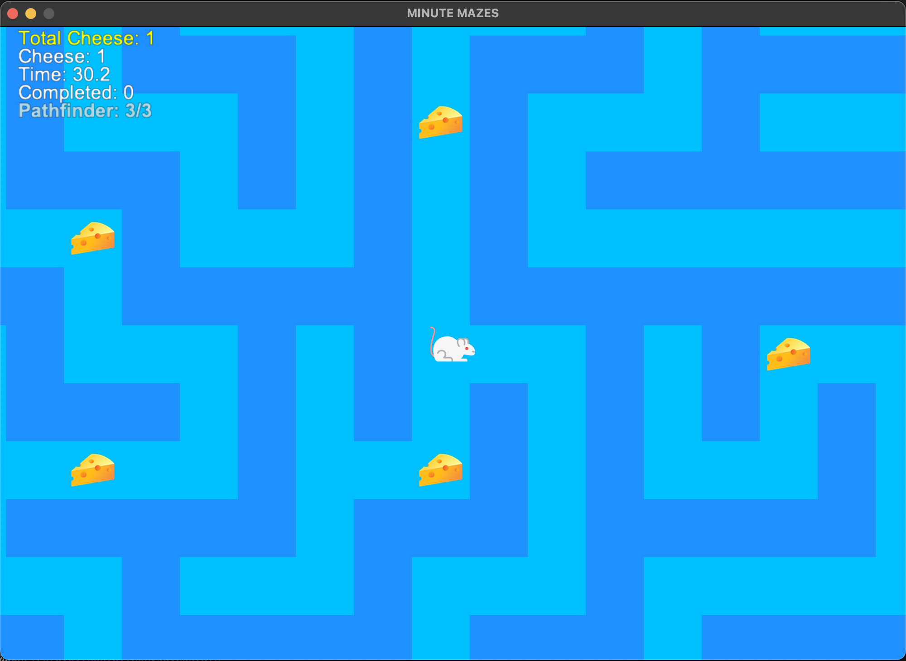

#
### Description: 
Minute mazes is a game where the player must navigate through a series of mazes. Each maze is generated with a depth-first search algorithm and is constructed with Python Arcade. 
```Python
# Create a maze using depth-first search algorithm
# The maze is created by walking through the grid and creating walls between cells
# The walls are created by setting the cell to TILE_EMPTY
def make_maze(maze_width, maze_height):
    maze = _create_grid_with_cells(maze_width, maze_height)

    w = (len(maze[0]) - 1) // 2
    h = (len(maze) - 1) // 2
    vis = [[0] * w + [1] for _ in range(h)] + [[1] * (w + 1)]

    def walk(x: int, y: int):
        vis[y][x] = 1

        d = [(x - 1, y), (x, y + 1), (x + 1, y), (x, y - 1)]
        random.shuffle(d)
        for (xx, yy) in d:
            if vis[yy][xx]:
                continue
            if xx == x:
                maze[max(y, yy) * 2][x * 2 + 1] = TILE_EMPTY
            if yy == y:
                maze[y * 2 + 1][max(x, xx) * 2] = TILE_EMPTY

            walk(xx, yy)

    walk(random.randrange(w), random.randrange(h))

    return maze
```
The player can move up, down, left, and right. The player can collect cheese in the maze and their score is displayed on the screen along with elapsed time for each maze. The player has an ability called "Pathfinder" that reveals a portion of the shortest path to the exit for a limited time. The game includes sound effects for collecting cheese, using abilities, and reaching the exit. The player can customize the maze size, mouse color, and sound volume in the settings menu.

#
### Setup
```
git clone https://github.com/ashton-put/MinuteMazesPython.git
python -m venv <your environment name>
source .<your environment name>/bin/activate
pip install -r requirements.txt
python play.py
```

#
### Controls
- When ```play.py``` is run - the Main Menu screen buttons direct the player to choose either:
```
| Start Game |
|  Settings  |
|    Quit    |
```

- In the 'Settings' menu, the player can adjust the maze size, mouse color, and effects volume:
```
Maze Size:
| Small (21x21) | Medium (31x31) | Large (51x51) |

Mouse Color:
| White | Gray | Brown |

Sound Volume: 75%

|---------*---|

| Back to Main Menu |
```

- ```| Start Game |``` starts the game with the selected maze size and mouse color.

- During gameplay:

```
WASD / Arrow Keys = Move through maze
        R         = Reset current maze (elapsed time and current score)
    ESC / ENTER   = Pause menu
    SPACE BAR     = Pathfinder ability (shows 10 tiles of the shortest path to the exit for 3 seconds, 3 uses per maze)
```

  - In the pause menu the player can choose to resume the game, access settings, return to the main menu, or quit the game.

#
### Image Citations and Tools
- https://www.photopea.com/ 
- https://www.youtube.com/watch?v=dMGIkO3xh1U 
- https://www.remove.bg/ 

- https://www.freepik.com/icon/mouse_5511456
- https://pngimg.com/image/25292 
- https://www.freepik.com/icon/mouse-toy_2830550

#

### Game Story (rough draft):
The year is 2052 and you are a lab mouse. Countless mice in the past have solved mazes with the promise of cheese at the end as a reward but YOU have been purposefully engineered and cybernetically enhanced to excel at just one thing: solving mazes as quickly as possible and with as high a cheese score as possible. You have brain chip implants, partially robotic limbs, sensory implants, and a reinforced nervous system that all enable you to navigate through mazes at incredible speeds. You can utilize your brains advanced computing power to show you the shortest path to the exit of any maze you are placed in for a short time. The lab technicians monitor your progress and performance as you solve maze after maze, keeping track of your best times and your cumulative score. 